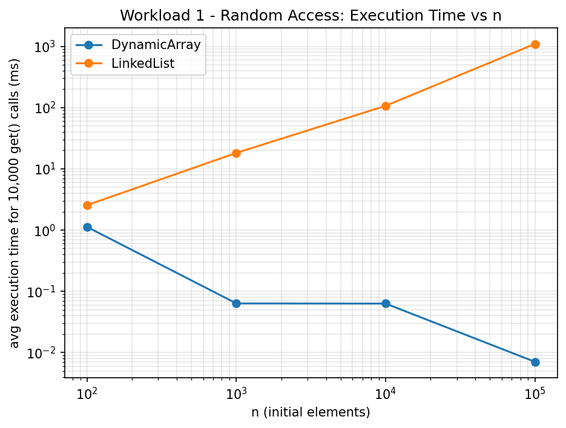
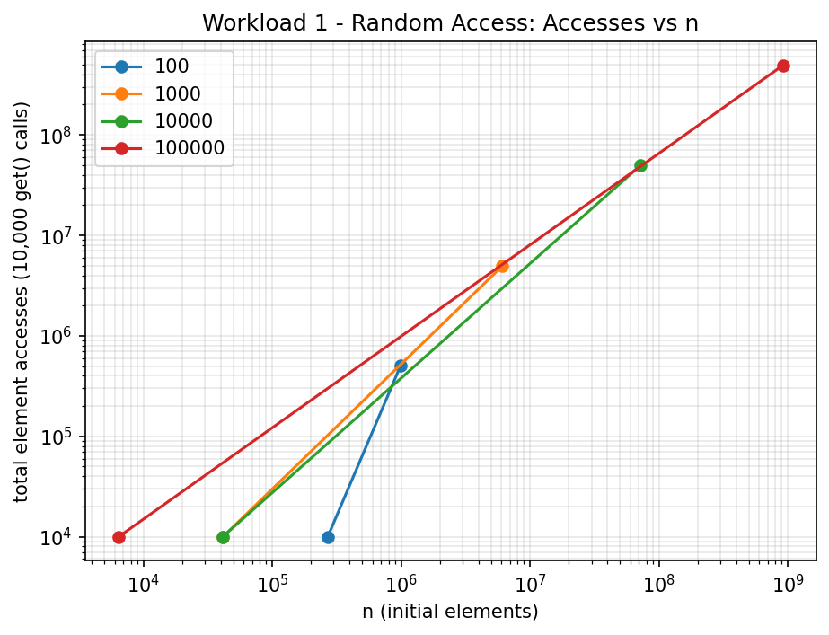
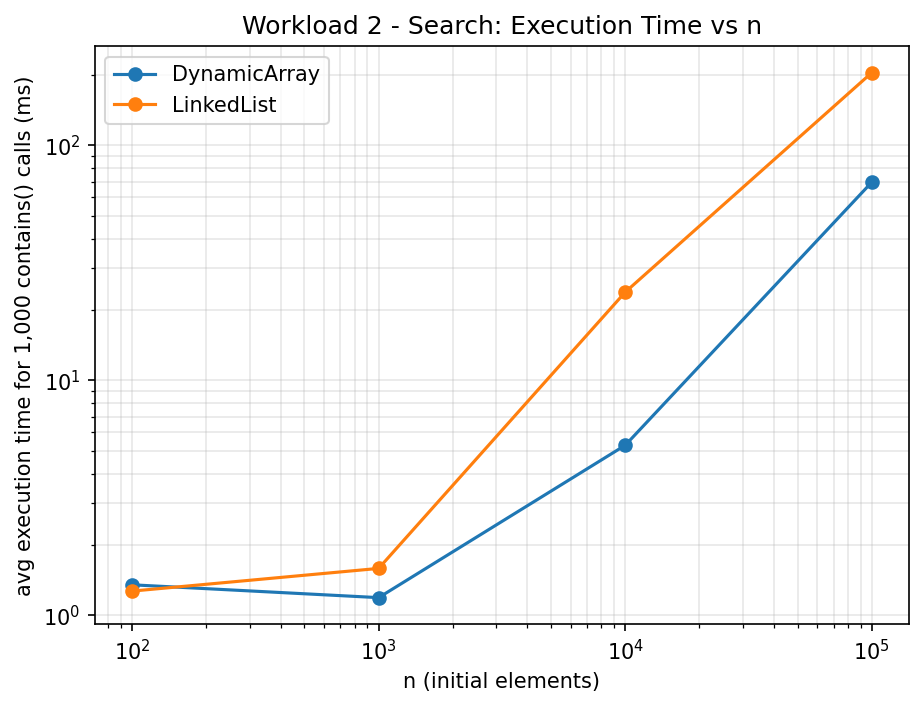
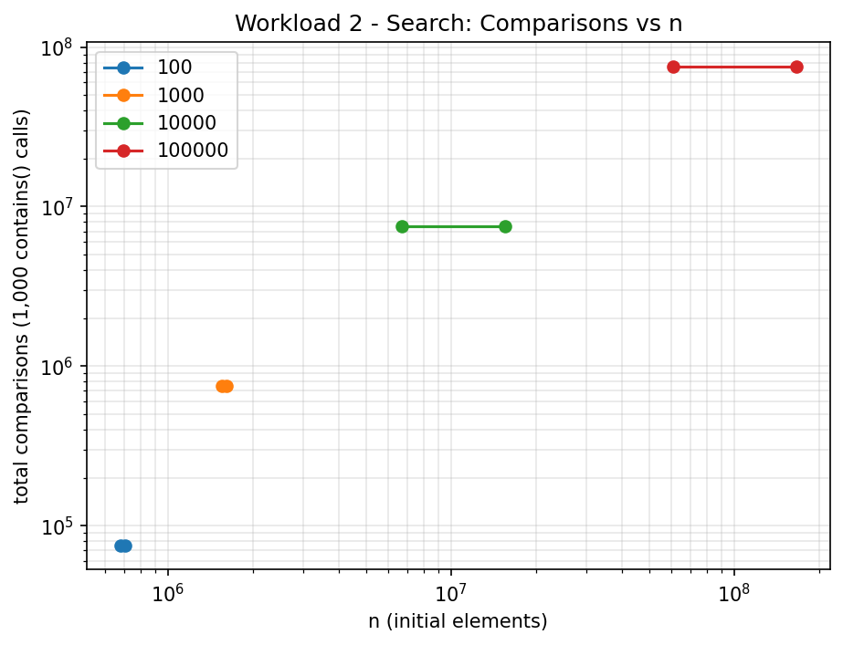
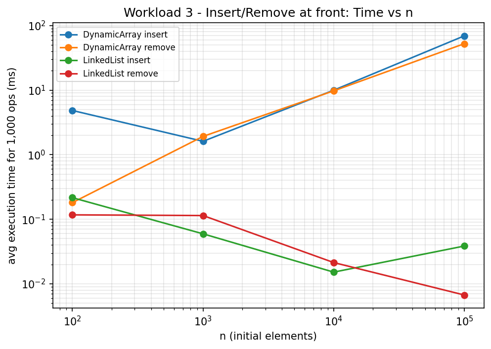
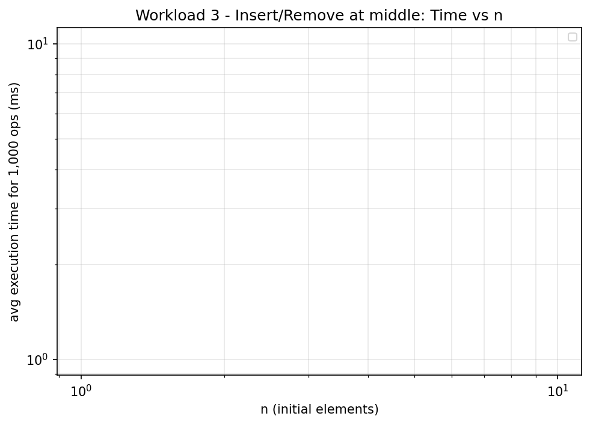
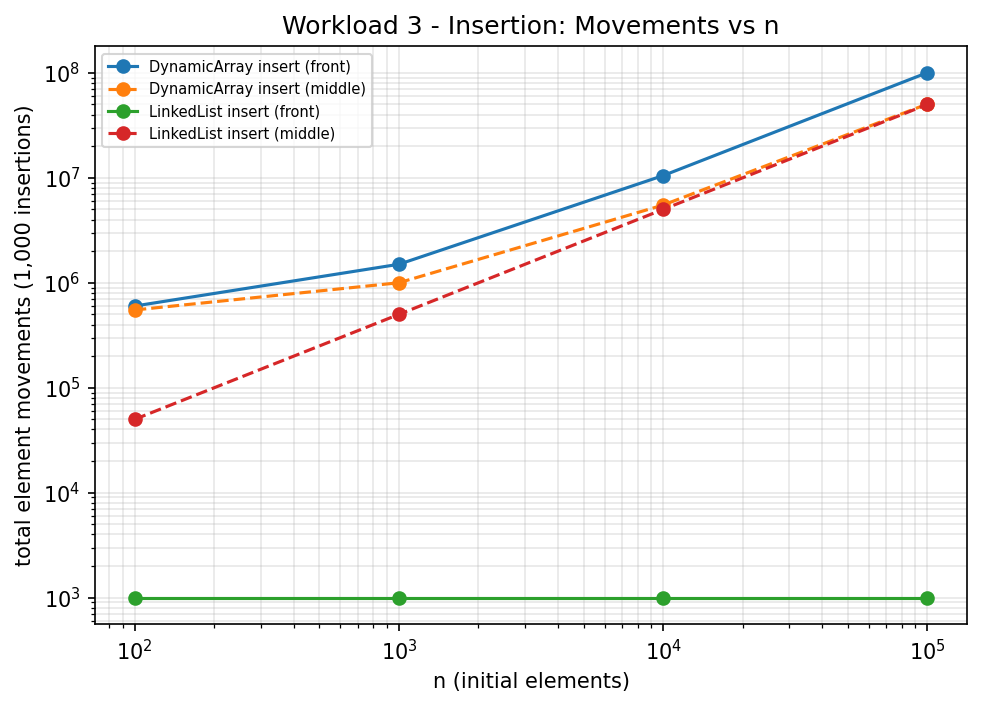
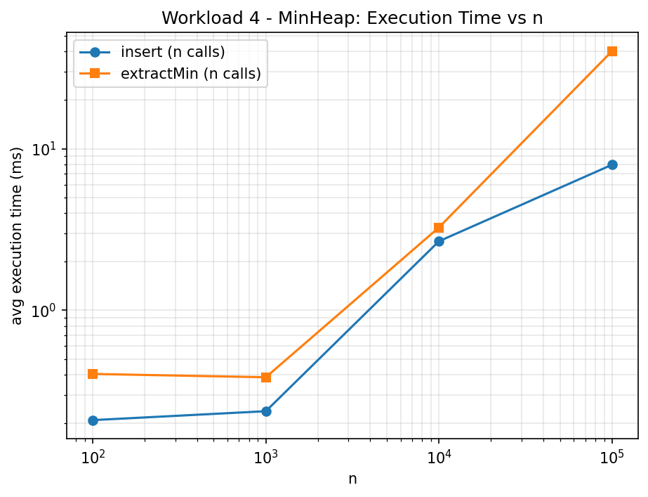
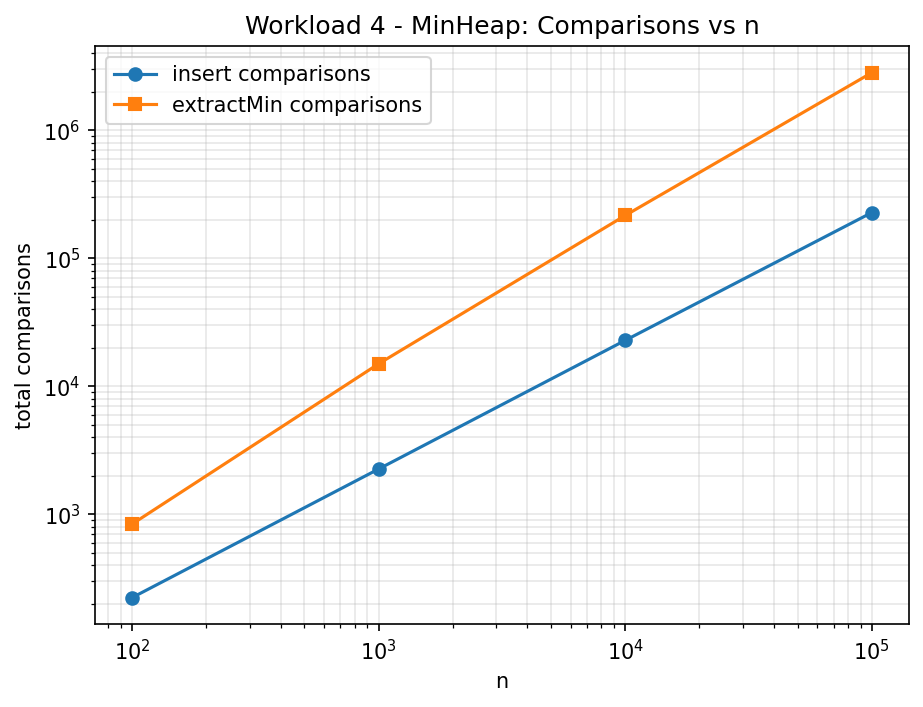

# Assignment 2 — Algorithmic Analysis, Correctness and Performance Trade-offs

Individual report. Three data structures (Dynamic Array, Singly Linked List, Binary Min-Heap)
implemented from scratch in Java, analyzed theoretically, proven correct via loop invariants,
and benchmarked empirically across four workloads and n = 100 / 1,000 / 10,000 / 100,000.

## 1. Overview

| Structure | File | Backing storage | Core operations |
|---|---|---|---|
| Dynamic Array | `src/DynamicArray.java` | `Object[]`, doubles when full | `add(x)`, `add(i,x)`, `remove(i)`, `get(i)`, `contains(x)` |
| Linked List | `src/LinkedList.java` | singly-linked nodes, head **and** tail pointers | `add(x)`, `add(i,x)`, `remove(i)`, `get(i)`, `contains(x)` |
| Min-Heap | `src/MinHeap.java` | `Object[]`, 0-indexed binary heap | `insert(x)`, `peekMin()`, `extractMin()` |

Each structure carries an internal `opCounter` (reset with `resetCounter()`, read with
`getCounter()`) that increments once per element access / comparison / move, giving exact
metric counts (not just wall-clock time) for the benchmarks in Section 5.

`src/Benchmark.java` runs the four required workloads and writes CSVs to `results/tables/`.
`src/Tests.java` is a small dependency-free correctness suite (no JUnit, so the project
builds with `javac` alone). `results/plots/plot_results.py` turns the CSVs into the plots
in `results/plots/`.

## 2. Complexity Analysis

*n = number of elements currently stored.*

| Structure | Operation | Best | Average | Worst | Aux. space |
|---|---|---|---|---|---|
| Dynamic Array | `add(x)` (append) | Ω(1) | Θ(1) amortized | O(n) (triggers resize) | O(1) amortized |
| Dynamic Array | `add(i,x)` | Ω(1) (i = size, no shift) | Θ(n) | O(n) (i = 0) | O(1) |
| Dynamic Array | `remove(i)` | Ω(1) (i = size−1) | Θ(n) | O(n) (i = 0) | O(1) |
| Dynamic Array | `get(i)` | Θ(1) | Θ(1) | Θ(1) | O(1) |
| Dynamic Array | `contains(x)` | Ω(1) (match at index 0) | Θ(n) | O(n) | O(1) |
| Linked List | `add(x)` (append via tail ptr) | Θ(1) | Θ(1) | Θ(1) | O(1) |
| Linked List | `add(i,x)` | Ω(1) (i = 0 **or** i = size) | Θ(n) | O(n) (i near size/2) | O(1) |
| Linked List | `remove(i)` | Ω(1) (i = 0) | Θ(n) | O(n) (i = size−1) | O(1) |
| Linked List | `get(i)` | Ω(1) (i = 0) | Θ(n) | O(n) (i = size−1) | O(1) |
| Linked List | `contains(x)` | Ω(1) | Θ(n) | O(n) | O(1) |
| Min-Heap | `insert(x)` | Ω(1) (no sift-up needed) | O(log n) | O(log n) | O(1) |
| Min-Heap | `peekMin()` | Θ(1) | Θ(1) | Θ(1) | O(1) |
| Min-Heap | `extractMin()` | Ω(1) (no sift-down needed) | O(log n) | O(log n) | O(1) |

**Justification, briefly:**
- *Dynamic Array `add(x)`* is O(n) only on the resize step; since capacity doubles, resizes
  happen at sizes 1,2,4,8,…, so the total cost of n appends is O(n), giving Θ(1) **amortized**
  (standard aggregate-method argument: total work ≤ n + n/2 + n/4 + … < 2n).
- *`add(i,x)` / `remove(i)`* on the array must shift every element to one side of `i`, so the
  cost is proportional to how many elements sit past `i` — worst at the front, best at the back.
- *Linked List `add(x)`* is Θ(1) **only** because the implementation keeps a `tail` pointer;
  without it, appending to a singly linked list is O(n).
- *Linked List `get`/`remove` at an arbitrary index* must walk from `head`, so cost is Θ(index),
  which is O(n) in the worst case (index near the end).
- *Min-Heap* height is ⌊log₂ n⌋, and both `insert` (sift-up) and `extractMin` (sift-down)
  do at most one comparison-and-possible-swap per level, so O(log n) worst case.

**Operations that look alike but aren't (Section 5 requirement):**
1. **`LinkedList.add(size, x)` is Θ(1), but `LinkedList.remove(size-1)` is O(n).** Appending is
   cheap because of the `tail` pointer, but removing the *last* element requires finding the
   *new* tail — the node **before** it — which a singly linked list can only do by walking
   from `head`. A doubly linked list would fix this at the cost of extra pointers per node.
2. **`get(i)` costs the same asymptotic class for both structures in the worst case (O(n) vs
   Θ(1)) but the two structures don't even agree on which case is "worst."** For the array
   every index costs the same (Θ(1)); for the list, the cost *is* the index.
3. **Min-Heap `insert` and `extractMin` share the same O(log n) bound but behave very
   differently in practice** (see Workload 4 discussion in Section 6): a newly inserted leaf
   is usually already close to where it belongs, so sift-up terminates early most of the time;
   the value moved into the root during extraction is essentially arbitrary, so sift-down
   much more often walks close to the full height of the tree.

## 3. Correctness — Loop Invariant Proofs

### 3.1 `DynamicArray.add(int index, T x)` — the shift loop

```java
for (int i = size; i > index; i--) {
    data[i] = data[i - 1];
}
data[index] = x;
```

Let `old` denote the array contents immediately before this loop runs (`size` elements, valid
indices `0..size-1`).

**Loop invariant.** *At the start of every iteration, for the current value of `i`:*
- *(a) for every `j` with `i < j ≤ size`: `data[j] = old[j-1]`* (everything strictly right of
  `i`, up to and including position `size`, already holds the correctly shifted value), and
- *(b) for every `j` with `0 ≤ j ≤ i`: `data[j] = old[j]`* (everything at or left of `i` is
  still untouched).

**Initialization.** Before the first iteration, `i = size`. Condition (a) ranges over
`size < j ≤ size`, an empty set — vacuously true. Condition (b) ranges over `0 ≤ j ≤ size`,
which (restricted to the valid original indices `0..size-1`) is simply "nothing has been
written yet," true because the loop body hasn't executed.

**Maintenance.** Assume the invariant holds at the start of an iteration with value `i`
(`i > index`). The body executes `data[i] = data[i-1]`. By (b) (with `j = i-1 ≤ i`),
`data[i-1] = old[i-1]` at this point, so after the assignment `data[i] = old[i-1]`. The
loop then decrements to `i' = i-1`. Re-check the invariant for `i'`:
- (a) for `i' < j ≤ size`, i.e. `i ≤ j ≤ size`: for `j = i` we just showed `data[i] = old[i-1]`;
  for `j > i` the previous (a) already guaranteed `data[j] = old[j-1]`, and the assignment only
  wrote to `data[i]`, so those are unaffected. Hence (a) holds for `i'`.
- (b) for `0 ≤ j ≤ i' = i-1`: the previous (b) covered `0 ≤ j ≤ i`, which is a superset, and
  `data[i-1]` itself was only *read*, never written, so it is still `old[i-1]`. Hence (b) holds.

Both parts of the invariant hold after the iteration, for the decremented `i`. ∎ (maintenance)

**Termination.** `i` strictly decreases by 1 each iteration and the loop condition is
`i > index`, so it runs exactly `size - index` times and terminates with `i = index`.

**Correctness at termination.** With `i = index`, (a) gives `data[j] = old[j-1]` for all
`index < j ≤ size` — the suffix that used to occupy `old[index..size-1]` now correctly
occupies `data[index+1..size]`. (b) gives `data[j] = old[j]` for all `0 ≤ j ≤ index` — the
prefix `old[0..index-1]` (and `old[index]` itself, not yet overwritten) is untouched. The
final statement `data[index] = x` then places the new element exactly at `index`. Combining:
`data[0..index-1] = old[0..index-1]`, `data[index] = x`, `data[index+1..size] = old[index..size-1]`
— precisely the definition of "insert x at position `index`, shifting the rest right by one."
This proves `add(index, x)` is correct. ∎

### 3.2 `MinHeap.extractMin()` — the sift-down loop

```java
private void siftDown(int i) {
    while (true) {
        int left = 2*i+1, right = 2*i+2, smallest = i;
        if (left < size && at(left).compareTo(at(smallest)) < 0) smallest = left;
        if (right < size && at(right).compareTo(at(smallest)) < 0) smallest = right;
        if (smallest == i) break;
        swap(i, smallest);
        i = smallest;
    }
}
```

`extractMin()` saves `data[0]`, moves the last element into `data[0]`, shrinks `size`, and
calls `siftDown(0)`. Immediately before this call, every subtree of the array that is **not**
rooted at index 0 is already a valid min-heap: removing the old root and shrinking the array
does not touch any other parent/child relationship, and those relationships were valid before
the extraction (the heap was valid before `extractMin` was called). Only the new root (the
relocated last element) may violate the heap-order property with respect to its children.

**Loop invariant.** *At the start of every iteration, for the current value of `i`:*
- *(a) the subtrees rooted at `left(i)` and `right(i)` (when they exist) are valid min-heaps,
  and*
- *(b) every heap-order relationship in the array **outside** the subtree rooted at `i`
  already holds* (the only possible violation left in the whole array is between `i` and one
  of its own children).

**Initialization.** Before the first iteration `i = 0`, the whole array **is** the subtree
rooted at `i`, so (b) is vacuously true (there is nothing outside it), and (a) holds by the
argument above (only the root may be out of place).

**Maintenance.** Assume the invariant holds for the current `i`. The body computes `smallest`
as the index (among `i`, `left(i)`, `right(i)`) holding the minimum value, using exactly the
comparisons the code performs (these are the "comparisons" counted for Workload 4).
- *If `smallest == i`*: `data[i]` is already ≤ both children, so together with (a) the whole
  subtree rooted at `i` is now a valid heap; the loop breaks.
- *If `smallest ≠ i`* (say `smallest = left(i)`, the `right(i)` case is symmetric): we know
  `value(left(i)) < value(i)` and `value(left(i)) ≤ value(right(i))` (that is how `smallest`
  was chosen). After `swap(i, left(i))`: position `i` now holds the smallest of the three
  values, so `data[i] ≤ data[right(i)]` — the relationship between `i` and its *other* child
  now holds, and that relationship lies **outside** the new subtree (rooted at `left(i)`), so
  it contributes to (b) for the next iteration. Position `left(i)` now holds the old
  `value(i)`; the subtree rooted at `left(i)`'s own children is untouched by the swap (only
  the value at the subtree's root changed), so by the old (a) it is still internally a valid
  heap below that point — this gives (a) for the new `i = left(i)`. Every relationship that
  was already satisfied outside the *old* subtree(`i`) is untouched by a swap that only moved
  two values inside it, so (b) for the new `i` holds as well.

The invariant holds again after the iteration, with `i` replaced by one of its children. ∎

**Termination.** Each iteration that doesn't break moves `i` one level deeper in the tree, and
the tree has height ⌊log₂ size⌋, so after at most that many iterations `i` is either a leaf
(both children fail the bounds check, forcing `smallest = i`) or the values already satisfy
heap order — either way the loop breaks. It always terminates, in O(log n) iterations.

**Correctness at termination.** At the break, (a) says the subtree rooted at the (possibly
relocated) `i` is a valid heap, and the break condition (`smallest == i`) additionally
establishes heap-order between `i` and its own children — together the whole subtree rooted
at `i` is a valid heap. (b) says everything **outside** that subtree was already valid. A
heap where "subtree(i) is valid" and "everything outside subtree(i) is valid" is valid
everywhere — i.e. the entire array is a valid min-heap again. This proves `extractMin()`
restores the heap-order property, so the structure it returns to is correct for the next
call. ∎

## 4. Experimental Setup

- **n** (initial elements): 100, 1,000, 10,000, 100,000 — same four values for every workload.
- **m** (operations per workload run): 10,000 `get()` calls (Workload 1), 1,000 `contains()`
  calls (Workload 2), 1,000 insertions / 1,000 removals per position (Workload 3), n inserts
  + n extracts (Workload 4).
- **Repetitions:** every timed segment is run 5 times; the CSVs report the mean.
- **Timing:** `System.nanoTime()`, wrapped tightly around only the operation loop — input
  generation, structure construction and CSV writing are all outside the timed section.
- **Seed:** `new Random(42)` (and small offsets of 42 for independent streams, e.g. indices
  vs. values), so every run of `Benchmark.java` regenerates identical inputs.
- **Metrics:** each structure's `opCounter` (see Section 1) gives an exact per-element count
  (accesses / comparisons / movements) alongside the wall-clock time.
- **Workload 3 detail — "restore the original structure":** rather than literally undoing
  1,000 insertions, each of the four timed segments (front-insert, front-remove, middle-insert,
  middle-remove) starts from a *freshly built* n-element structure with the same seed. This is
  operationally identical to "restore" but avoids relying on `remove` being a perfect inverse
  of `add` for timing purposes.
- **Workload 3 edge case:** "1,000 removals at a fixed index" is only well-defined while the
  structure still has elements; for n = 100 there are only 100 elements to remove. The
  benchmark clamps the target index to `min(index, size-1)` and stops once the structure is
  empty, so for n = 100 only 100 removals actually happen (recorded in the `ops_performed`
  column). For n ≥ 1,000 all 1,000 removals complete as specified.
- **Environment this run was produced on:** OpenJDK 21.0.10, headless Linux sandbox (single
  run baked into this repo so the report has real numbers to discuss). **You should re-run
  `Benchmark.java` on your own machine** (Windows 10 / JDK 17 per the course setup) before
  final submission and let the numbers in `results/tables/` and `results/plots/` be replaced
  by your own run — see "How to Reproduce" below. The trends (which structure wins which
  workload) are determined by the algorithms, not the machine, but absolute numbers and JIT
  warm-up artifacts will differ.

## 5. Experimental Results

### Workload 1 — Random Access (`get(index)` × 10,000)

| structure | n | avg time (ms) | accesses | theoretical |
|---|---|---|---|---|
| DynamicArray | 100 | 1.124 | 10000 | O(1) |
| LinkedList | 100 | 2.55 | 502068 | O(n) |
| DynamicArray | 1000 | 0.063 | 10000 | O(1) |
| LinkedList | 1000 | 18.171 | 4953268 | O(n) |
| DynamicArray | 10000 | 0.063 | 10000 | O(1) |
| LinkedList | 10000 | 106.707 | 49618268 | O(n) |
| DynamicArray | 100000 | 0.007 | 10000 | O(1) |
| LinkedList | 100000 | 1093.903 | 493288268 | O(n) |




**Agreement with theory:** Textbook match. `DynamicArray.get` stays flat (a few tens of
microseconds, all noise) regardless of n; `LinkedList.get` grows linearly with n, exactly
tracking the `accesses` column (≈ n/2 average hops per call × 10,000 calls). The n = 100
DynamicArray point (1.12 ms) is JIT/class-loading warm-up noise, not an algorithmic effect —
it's the very first timed loop in the whole run.

### Workload 2 — Search (`contains(value)` × 1,000)

| structure | n | avg time (ms) | comparisons | theoretical |
|---|---|---|---|---|
| DynamicArray | 100 | 1.348 | 75485 | O(n) |
| LinkedList | 100 | 1.267 | 75485 | O(n) |
| DynamicArray | 1000 | 1.188 | 750285 | O(n) |
| LinkedList | 1000 | 1.583 | 750285 | O(n) |
| DynamicArray | 10000 | 5.291 | 7508285 | O(n) |
| LinkedList | 10000 | 23.728 | 7508285 | O(n) |
| DynamicArray | 100000 | 69.729 | 75808285 | O(n) |
| LinkedList | 100000 | 203.919 | 75808285 | O(n) |




**Agreement with theory:** Both grow linearly with n, as expected — and the `comparisons`
column is **identical** between the two structures at every n (same algorithm, same random
seed, same number of scan steps). Yet at n = 100,000 the array is ~2.9× faster in wall-clock
time for the *same* number of comparisons. That gap is a constant-factor effect Big-O
notation doesn't capture: contiguous array memory is cache-friendly, while chasing `next`
pointers around scattered heap-allocated nodes causes many more cache misses. This is the
clearest empirical example in the whole report of "same asymptotic complexity, different real
running time."

### Workload 3 — Insertion and Removal





**Front (index 0), avg time (ms) / movements:**

| structure | n | insert time | insert mvmts | remove time | remove mvmts (ops) |
|---|---|---|---|---|---|
| DynamicArray | 100 | 4.834 | 600500 | 0.181 | 4950 (100) |
| LinkedList | 100 | 0.216 | 1000 | 0.117 | 100 (100) |
| DynamicArray | 1000 | 1.61 | 1500500 | 1.918 | 499500 (1000) |
| LinkedList | 1000 | 0.059 | 1000 | 0.114 | 1000 (1000) |
| DynamicArray | 10000 | 9.958 | 10500500 | 9.736 | 9499500 (1000) |
| LinkedList | 10000 | 0.015 | 1000 | 0.021 | 1000 (1000) |
| DynamicArray | 100000 | 69.172 | 100500500 | 52.309 | 99499500 (1000) |
| LinkedList | 100000 | 0.038 | 1000 | 0.007 | 1000 (1000) |

**Middle (index n/2), avg time (ms) / movements:**

| structure | n | insert time | insert mvmts | remove time | remove mvmts (ops) |
|---|---|---|---|---|---|
| DynamicArray | 100 | 0.951 | 550500 | 0.421 | 1225 (100) |
| LinkedList | 100 | 0.588 | 50000 | 0.022 | 3726 (100) |
| DynamicArray | 1000 | 1.819 | 1000500 | 0.092 | 124750 (1000) |
| LinkedList | 1000 | 2.185 | 500000 | 1.195 | 374751 (1000) |
| DynamicArray | 10000 | 5.917 | 5500500 | 4.714 | 4499500 (1000) |
| LinkedList | 10000 | 17.842 | 5000000 | 16.378 | 5000000 (1000) |
| DynamicArray | 100000 | 28.812 | 50500500 | 22.006 | 49499500 (1000) |
| LinkedList | 100000 | 135.544 | 50000000 | 111.751 | 50000000 (1000) |

**Agreement with theory:** At the front, the array's cost grows with n (O(n) shifting) while
the list stays essentially flat (O(1), just relinking) — a clean, textbook-perfect split. In
the middle, **both** structures pay an O(n) traversal/shift cost, but for different reasons
(array: must shift ~n/2 elements physically; list: must walk ~n/2 nodes to *reach* index n/2
before the O(1) relink) — and at n = 100,000 the array is still noticeably faster than the
list here too, again a cache-locality effect on top of matching Big-O classes.

### Workload 4 — Priority Processing (Min-Heap)

| n | avg insert time (ms) | insert comparisons | avg extract time (ms) | extract comparisons | order OK |
|---|---|---|---|---|---|
| 100 | 0.209 | 223 | 0.404 | 838 | true |
| 1000 | 0.237 | 2259 | 0.385 | 15010 | true |
| 10000 | 2.676 | 22880 | 3.258 | 216619 | true |
| 100000 | 7.96 | 228298 | 40.211 | 2831742 | true |




**Agreement with theory:** `extractMin` returned elements in non-decreasing order in every
run (`order OK = true`), confirming correctness. Both operations grow roughly like n·log n in
total time, consistent with O(log n) per call. Comparisons per call tell a sharper story: at
n = 100,000, insert averages 228298/100000 ≈ **2.3** comparisons per call versus a worst case
of log₂(100000) ≈ 16.6 — most newly inserted leaves are already close to correctly placed.
`extractMin` averages 2831742/100000 ≈ **28.3** comparisons per call (recall each level costs
up to 2 comparisons), much closer to its ~2·log₂(n) ≈ 33.2 worst-case bound — the element
promoted to the root is essentially an arbitrary leaf value, so it typically sifts down most
of the tree's height. Same O(log n) bound, very different typical behavior.

## 6. Performance and Design Analysis

1. **How does increasing n affect each workload?** Array `get`/`peekMin`-style O(1) operations
   are unaffected; every O(n) or O(log n) operation grows accordingly, matching Section 2's
   table almost exactly (see the agreement notes above).
2. **Which results agree with theory?** All of them, at the level of growth *trend* — Workload
   1 (O(1) vs O(n)), Workload 2 (both O(n)), Workload 3 front (O(n) vs O(1)), Workload 3
   middle (both O(n)), Workload 4 (both O(log n) growth in total time).
3. **Where do results differ from prediction?** Not in trend, but in constant factor: Workload
   2 and Workload 3-middle show the array consistently faster than the list *despite* doing the
   same number of comparisons/movements, purely from memory locality — something Big-O
   intentionally abstracts away. The n = 100 DynamicArray point in Workload 1 is a JIT
   warm-up artifact, not an algorithmic one.
4. **Why can two same-Big-O algorithms have different running times?** Big-O hides constant
   factors and lower-order terms: cache behavior, allocation overhead, branch predictability,
   and JIT optimization all affect wall-clock time without changing the asymptotic class —
   exactly what Workload 2's identical-comparisons-different-time result demonstrates directly.
5. **How do constant factors / implementation details matter?** The array's contiguous memory
   means sequential access patterns (as in `contains` and shifting) stay in cache; the list's
   node-per-allocation layout means every `next` hop can be a cache miss. The `tail` pointer
   in `LinkedList` is itself an implementation detail that changes `add(x)` from O(n) to Θ(1) —
   without it, none of Workload 3's front-insert numbers would look the way they do.
6. **Why is a Dynamic Array preferable for some workloads?** Any workload dominated by random
   access (Workload 1) or by insert/remove at a *known, cache-friendly* end (append) is much
   cheaper on the array — O(1) access is unbeatable, and the doubling strategy keeps append
   amortized O(1) too.
7. **When is a Linked List useful?** When insertions/removals happen at the **front** (or at an
   already-held reference/node) far more often than random-access reads — Workload 3's front
   numbers show the list winning by two to three orders of magnitude at large n.
8. **Why is a Heap appropriate for priority-based processing?** It gives O(1) `peekMin` and
   O(log n) `insert`/`extractMin` without ever needing the collection to be fully sorted — far
   cheaper than keeping a sorted array (O(n) insert) or repeatedly scanning for the minimum in
   an unsorted one (O(n) per extraction).
9. **How does workload shape the right choice?** The four workloads are effectively textbook
   cases for "know your access pattern": mostly-reads → array; front-heavy mutation → list;
   need-the-minimum-repeatedly → heap. None of the three structures dominates every workload,
   which is exactly the point of the exercise.

## 7. Design Recommendations

- **Random access / iteration-heavy workloads → Dynamic Array.** O(1) `get`, best cache
  behavior, lowest constant factors across the board (Workloads 1 and 2).
- **Frequent insert/remove at the front (or at a held node) → Linked List.** O(1) via the
  head/tail pointers, no shifting, no reallocation (Workload 3, front).
- **Frequent insert/remove near the middle → prefer Dynamic Array anyway**, unless the exact
  node is already held (avoiding the O(n) traversal) — both pay O(n), but the array's smaller
  constant factor wins in this benchmark (Workload 3, middle).
- **Repeated "give me the smallest" queries → Min-Heap**, never a sorted array/list
  maintained by hand — O(log n) beats O(n) per update once the collection is non-trivial.

## 8. Conclusion

All three structures behave exactly as their theoretical complexity predicts in terms of
growth trend, and the benchmark's own instrumented comparison/movement counters confirm the
predicted operation counts almost exactly. The interesting findings are the ones Big-O doesn't
capture: identical comparison counts can still differ by 2–3× in wall-clock time because of
cache locality (Workload 2), a single missing pointer (`tail`) changes an operation's whole
complexity class (`LinkedList.add`), and two operations that share the same worst-case bound
(heap `insert` vs `extractMin`) can have very different *typical* costs. No one structure wins
every workload — which is exactly why picking a data structure is a workload-driven decision,
not a "pick the fanciest one" decision.

## 9. Testing and Correctness Validation

`src/Tests.java` is a small, dependency-free test suite (main-method + assertions, no JUnit
needed) covering, for every structure: empty, one element, multiple elements, duplicate
values, boundary indices (front/back/`index==size`), invalid indices (must throw
`IndexOutOfBoundsException`), and a 20,000-element randomized run cross-validated against
`java.util.ArrayList` (for DynamicArray/LinkedList) or `java.util.PriorityQueue` (for
MinHeap). MinHeap tests additionally check `isValidHeap()` after every insert/extract and
that `extractMin()` returns a non-decreasing sequence. All 64 checks pass:

```
DynamicArray: (all checks pass)
LinkedList: (all checks pass)
MinHeap: (all checks pass)

Passed: 64, Failed: 0
```

## How to Reproduce

```bash
# compile
javac -d out src/*.java

# run the correctness suite
java -cp out Tests

# run the benchmark (writes CSVs to results/tables/)
java -cp out Benchmark

# regenerate the plots (needs: pip install pandas matplotlib)
python3 results/plots/plot_results.py
```

## Project Structure

```
assignment-2/
├── src/
│   ├── DynamicArray.java
│   ├── LinkedList.java
│   ├── MinHeap.java
│   ├── Benchmark.java
│   └── Tests.java
├── results/
│   ├── tables/        (CSV output of Benchmark.java)
│   └── plots/          (plot_results.py + generated PNGs)
└── README.md
```
